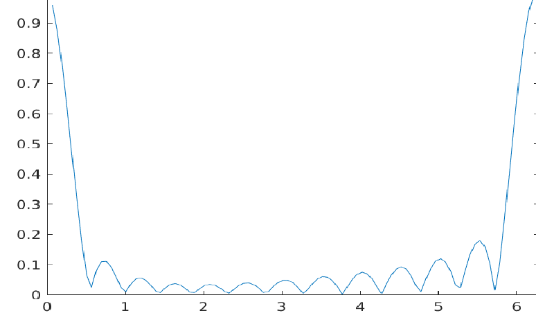

# TU/e Mathematics 2 (5EMA0)

Convex optimization exercises for the Mathematics 2 course (5EMA0) at Eindhoven
University of Technology (TU/e). Each problem is modeled and solved in MATLAB with the
CVX toolbox. The work covers the standard workflow of the course: take an engineering
problem, reformulate it as a convex program (usually a linear or second-order cone
program), solve it with CVX, and read off the primal solution together with the dual
variables for sensitivity analysis.

## Assignment 1: approximation problems

Three ways to fit `Ax` to a target `b`, each formulated as a convex program and solved
on the same randomly generated data:

- `assignment1_1.m`: minimax (Chebyshev) approximation. Minimizes the largest absolute
  residual `max|b - Ax|` by bisecting on the bound `t` and solving a CVX feasibility
  problem at each step.
- `assignment1_2.m`: least absolute deviations. Minimizes `sum|b - Ax|` as a linear
  program and reports the dual variables of the residual constraints.
- `assignment1_3.m`: Huber-style penalty. Minimizes a piecewise penalty
  `max(2|z| - 1, |z|)` on the residuals, written as a linear program with its full dual.

The report `assignment-1-group-17.pdf` derives the primal and dual forms of each problem
by hand before implementing them.

## Assignment 2: antenna array beamforming and the diet problem

- `assignment2_1.mlx`, `assignment2_2.mlx`, `assignment2_3.mlx`: antenna array weight
  design. For antenna positions on a circle the array response is
  `A(k) = exp(j(cos(theta_k)x + sin(theta_k)y))`. The weights `z` are chosen to hold the
  gain at the target direction while minimizing the response over the sidelobe angles,
  giving a beam pattern with low sidelobes. The three variants change the constrained
  angle set and the norm used in the objective.
- `varied_diet.mlx`: a diet linear program solved for primal and dual solutions, with a
  lower bound from the dual and a check of how the optimal solution shifts as the cost
  vector changes.

The plot below is the optimized array gain across angle for one of the beamforming cases.
Gain is held near one at the two look directions (near 0 and 2 pi) while the sidelobes in
between are pushed down.

## Additional CVX exercises

- `bandpass_filter.m`: FIR bandpass filter design. Minimizes the worst-case stopband
  response and sweeps the filter length to show how the achievable attenuation improves.
- `convex_triangle.m`: minimal surface area over a triangulated mesh with fixed boundary
  heights, minimizing the summed triangle areas.
- `rocket_control.m`: discrete-time trajectory optimization. Steers a body from a start
  to a target state over 20 steps under thrust limits, across four scenarios with
  different objectives (minimize total thrust versus peak thrust) and different
  disturbances (air resistance and wind).
- `signal_feasability.m`: transmitter power control. Maximizes the minimum
  signal-to-interference ratio across a wireless network of 10 transmitters and 100
  receivers by bisection over feasibility problems.
- `storage_space.m`: a storage allocation linear program solved for the primal
  allocation and the dual prices of the demand constraints.

## Running

The scripts need MATLAB with the [CVX](http://cvxr.com/cvx/) toolbox installed and on the
path. Open a `.m` script or `.mlx` live script and run it. The `.mlx` files are MATLAB
Live Scripts and open in the Live Editor.

## Technologies

MATLAB, CVX, linear and second-order cone programming, duality and sensitivity analysis.
